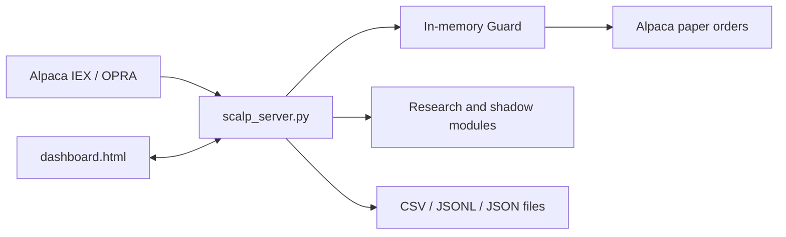
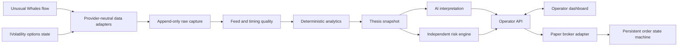

# Scalpr Architecture

## Current system

The legacy application is a local FastAPI service serving `dashboard.html` on `127.0.0.1:8420`.

`scalp_server.py` currently owns broker clients, API routes, polling, schedulers, Guard state, order submission, journaling, and research integration. Research modules are more isolated and versioned, but most persistence is file-based and path-relative.

Scope is intentionally two-tiered. `scope_policy.py` is the unchanged,
fail-closed SPY 0-2 DTE default used by automated systems. The dashboard's
explicit manual-paper endpoint alone may call `manual_scope_policy.py` for
Alpaca-validated US-equity/ETF options with 0-60 DTE. Out-of-envelope manual
Guards are tagged at creation and filtered before research enrichment and
validated journal analytics (ADR-019).

## Current module groups

- Trading/API: `scalp_server.py`, `dashboard.html`, `precheck.py`, `journal_model.py`.
- Workup/flow: `workup.py`, `workup_api.py`, `flow_evidence.py`.
- Timing/feed: `bar_builder.py`, `feed_quality.py`, `micro_read.py`.
- Regime/premarket: `regime_model.py`, `regime_research.py`, `session_snapshot.py`, `premarket.py`, `premarket_shadow.py`.
- Intelligence lifecycle: `feature_engine.py`, `label_lifecycle.py`, `intel_validation_report.py`, `entry_policy.py`.
- Wave shadow: `wave_*` modules.
- Incubation shadow: `incubation_*` modules.
- Audit capture: `guard_events.py` (not yet wired).

## Target V2 boundaries

### Boundary rules

- Feed adapters preserve provider and receipt timestamps separately.
- Raw capture is append-only and replayable.
- Analytics owns all numerical calculation and versioned policies.
- AI consumes a typed snapshot and cannot override risk or submit orders.
- Risk is deterministic, fail-closed, and independently tested.
- Broker integration begins with a paper-only adapter.
- Unusual Whales is the sole institutional-flow provider; vendor events are
  normalized before feature engineering and can never independently trigger a
  trade.
- UW session capture, IVolatility EOD capture, and the Cloud SQL evidence mirror
  run as isolated read-only workers. Cloud SQL is a content-hashed query mirror;
  local append-only files remain the source of truth.
- Persistent position/order state is reconciled with the paper broker at startup.
- API/UI surfaces state; they do not embed trading policy.

## Migration approach

Build V2 beside legacy. Migrate deterministic modules behind typed contracts, replay historical sessions, compare outputs, and cut over UI/workflows only after parity gates pass. Legacy execution is retired last.
